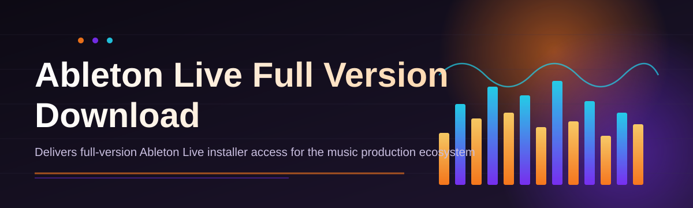
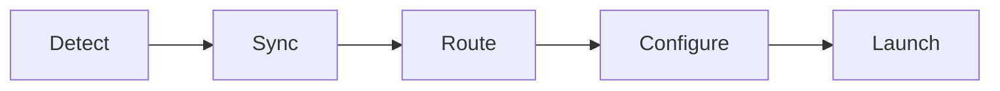

# ableton-live-suite-manager 🎛️🚀

  

*A no-nonsense manager that gets your Ableton Live setup organized, updated, and ready to make noise — minus the headaches.*

  

---

## 🧠 Overview

Let's be honest: the Ableton Live ecosystem is powerful, but the *getting-started-and-staying-organized* part has always been a mess of scattered installers, mismatched plugin folders, and version confusion. `ableton-live-suite-manager` exists because I got tired of babysitting my own DAW setup and figured a few thousand other producers probably felt the same way. This project is a lightweight companion app that sits next to your Ableton Live installation and handles the boring-but-critical stuff: version tracking, config sanity checks, and a clean landing page workflow for the Ableton Live full version download process so you're not hunting through forums at 2 AM before a session.

This isn't a replacement for Ableton, and it never will be — it's the friendly wrapper around the experience. Think of it as the pit crew for your DAW: it doesn't drive the car, but it makes sure the tires are pumped and the fuel line is clean before you hit the studio. Whether you're a bedroom producer setting up your first rig, a touring artist syncing configs across three laptops, or a sound design nerd who just wants a tidy suite manager, this tool was built with you in mind.

The community angle matters here too. This repo isn't a solo vanity project — it's meant to grow with contributions, bug reports, and feature requests from actual musicians who use it daily. If you've ever wished the whole "download, verify, configure, launch" pipeline for Ableton Live full version download was less of a chore and more of a two-click formality, you're exactly who we built this for.

> [!TIP]
> Bookmark the landing page above. It's the single source of truth for the current build — no mirrors, no sketchy re-uploads, no guessing games.

---

## 🔥 What This Thing Actually Does

- **Version-aware suite tracking** — knows which Ableton Live build you're running and flags when your setup is drifting out of sync with your project files.

- **One-click launch profiles** — save different audio driver + plugin configurations and swap between "studio mode" and "live gig mode" without digging through preferences menus.

- **Smart download landing** — routes you to the correct Ableton Live full version download page for your platform instead of leaving you to guess which installer is legit.

- **Config backup & restore** — snapshots your Live preferences, key mappings, and templates so a botched update doesn't nuke six months of muscle memory.

- **Plugin folder sanity checker** — scans your VST/AU directories for broken links, duplicate installs, and orphaned presets cluttering your browser panel.

- **Lightweight footprint** — the manager itself is a standalone Windows executable. No background services, no telemetry-happy daemons eating your CPU cycles.

- **Dark-mode-first UI** — because staring at a bright white settings panel at 3 AM during a mix session is a crime against your eyes.

- **Session template library** — quick-access starter templates so new projects don't begin from a blank, intimidating void.

> [!NOTE]
> This tool manages your *setup*, not your music. It won't quantize your drums or fix your mix — that's still on you.

---

## ⚡ Getting Started (It's Genuinely This Simple)

1. **Visit the landing page** using the download button above — that's the only place this project distributes builds from.

2. **Download the installer** for your Windows version (10 or 11, both fully supported).

3. **Run the executable** — no dependency installs, no separate runtime downloads, no fuss.

4. **Launch the manager**, let it detect your existing Ableton Live installation (or guide you through a fresh Ableton Live full version download), and you're set.

> [!IMPORTANT]
> Always run the installer with standard user permissions first. Only escalate to admin rights if the app explicitly prompts you — most setups don't need it.

---

## 🖥️ System Requirements

| Component | Minimum | Recommended |
|---|---|---|
| OS | Windows 10 (64-bit) | Windows 11 (64-bit) |
| RAM | 4 GB | 8 GB+ |
| Storage | 500 MB free | 2 GB+ free (for templates/backups) |
| Dependencies | None | None |
| .NET / Runtime | Bundled | Bundled |
| Internet | Required for initial setup | Recommended for updates |

<strong>Why no Mac support yet?</strong>

Short answer: bandwidth. Long answer: the manager currently hooks into Windows-specific config paths and driver profiles. A macOS build is on the community roadmap — see the Contributing section if you want to help make it happen.

---

## 🛠️ How It Works

The architecture is intentionally simple — a thin manager layer that orchestrates a few well-defined steps rather than reinventing anything Ableton already does well:

1. **Detection** — scans local drives for existing Live installations and config files.

2. **Sync check** — compares your installed build against the current suite manifest.

3. **Routing** — if you need a fresh copy, it points you to the correct Ableton Live full version download landing page.

4. **Configuration** — applies your saved profiles, backups, and plugin mappings post-install.

5. **Launch** — hands off control to Ableton Live itself. The manager steps aside once your DAW is running.

---

## 🧩 Troubleshooting

**Q: The manager says my installation is "unrecognized" — what gives?**
A: This usually happens after a manual reinstall that skipped the default directory. Point the manager to your custom install path in Settings > Detection.

**Q: I downloaded via the landing page but the installer won't run.**
A: Check that Windows SmartScreen isn't silently blocking it — click "More info" then "Run anyway." Also confirm you didn't grab it from a third-party mirror; we only support the official landing page build.

**Q: My plugin folder scan is stuck at 90%.**
A: Large sample libraries with thousands of nested subfolders can slow the scanner. Give it a minute — it's thorough, not broken.

**Q: Can I run multiple Ableton Live versions side by side?**
A: Yes, the launch profiles feature was built exactly for this. Create a separate profile per version and switch freely.

**Q: My saved backup won't restore correctly.**
A: Make sure you're restoring onto the same major Live version it was backed up from. Cross-version preference restores are still flaky — it's on the roadmap.

**Q: Does this affect my actual Ableton license or authorization?**
A: No. The manager only touches configs, folders, and launch profiles — your Live authorization flow stays completely untouched.

---

## 🎨 UI / UX Details

The interface leans minimal on purpose — fewer clicks, less clutter, more time actually producing.

### Keyboard Shortcuts

| Shortcut | Action |
|---|---|
| `Ctrl + O` | Open suite manager dashboard |
| `Ctrl + D` | Jump to download / update page |
| `Ctrl + S` | Save current launch profile |
| `Ctrl + Shift + S` | Backup current preferences |
| `Ctrl + R` | Restore last backup |
| `Ctrl + Shift + P` | Open plugin folder scanner |
| `Ctrl + K` | Quick search across settings |
| `F5` | Refresh version/sync status |
| `Alt + L` | Launch Ableton Live directly |
| `Esc` | Close active dialog |

### Themes

- **Midnight** (default) — dark, low-glare, session-friendly.

- **Studio Light** — for daytime setup work.

- **High Contrast** — accessibility-focused, larger UI targets.

### Settings Highlights

- Auto-detect install path toggle

- Backup frequency (manual / on-launch / scheduled)

- Notification verbosity (silent / normal / chatty)

---

## 🤝 Contributing & Community

> [!NOTE]
> This project runs on community fuel. Stars are nice, but pull requests and honest bug reports are what actually move it forward.

We keep an open roadmap and welcome contributors of all experience levels:

- **Bug reports** — open an issue with your OS version, Live version, and repro steps.

- **Feature requests** — check existing Discussions before filing a duplicate.

- **Pull requests** — fork, branch, and keep changes focused. Small, reviewable PRs get merged faster than mega-PRs.

- **Documentation** — even fixing a typo in this README counts. Seriously.

Current community-driven roadmap items:

- [ ] macOS build exploration

- [ ] Cross-version backup restore fixes

- [ ] Community template marketplace

- [ ] Localization pass (non-English UI strings)

Join the conversation in the Discussions tab — that's where roadmap priorities actually get decided, not in some private backlog nobody sees.

---

## 📜 License

Released under the [MIT License](LICENSE), 2026. Do good things with it.

---

## ⚠️ Disclaimer

This project is an independent, community-built utility and is not affiliated with, endorsed by, or officially connected to Ableton AG. "Ableton Live" is a trademark of its respective owner. This tool is provided as-is, without warranty, for managing your own legitimately obtained software installation. Use responsibly.

